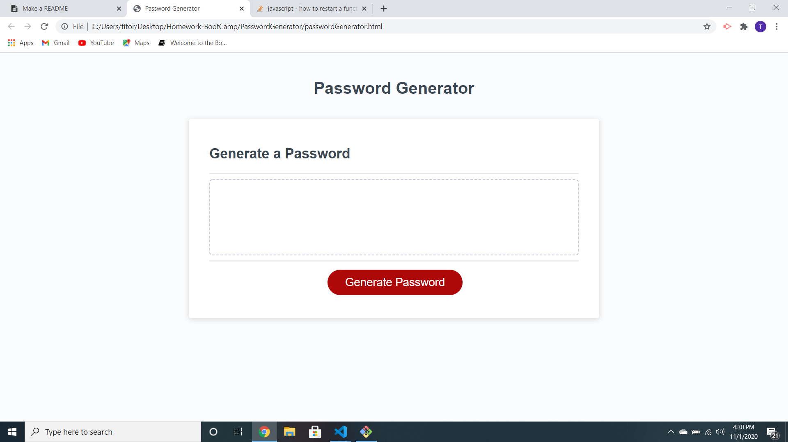
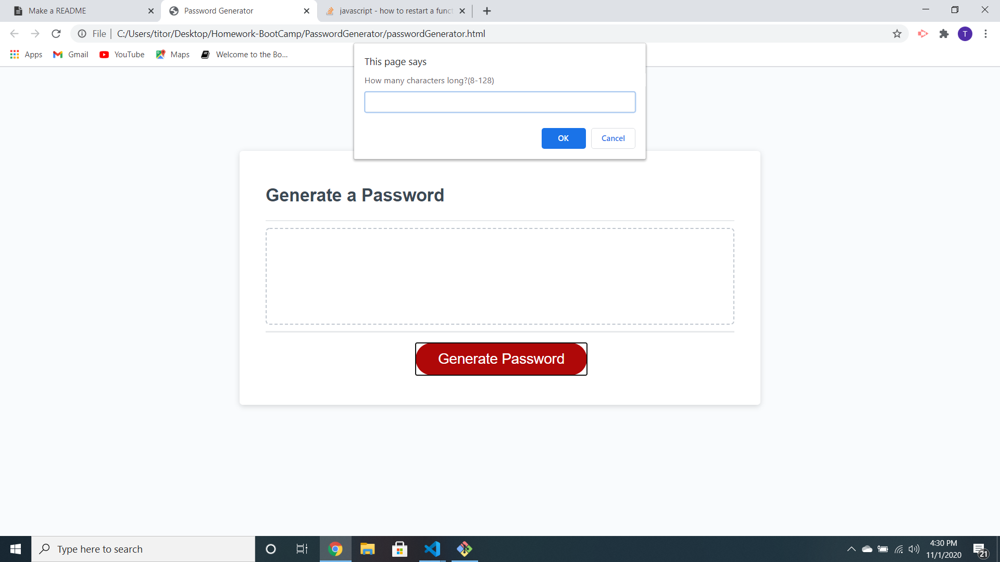
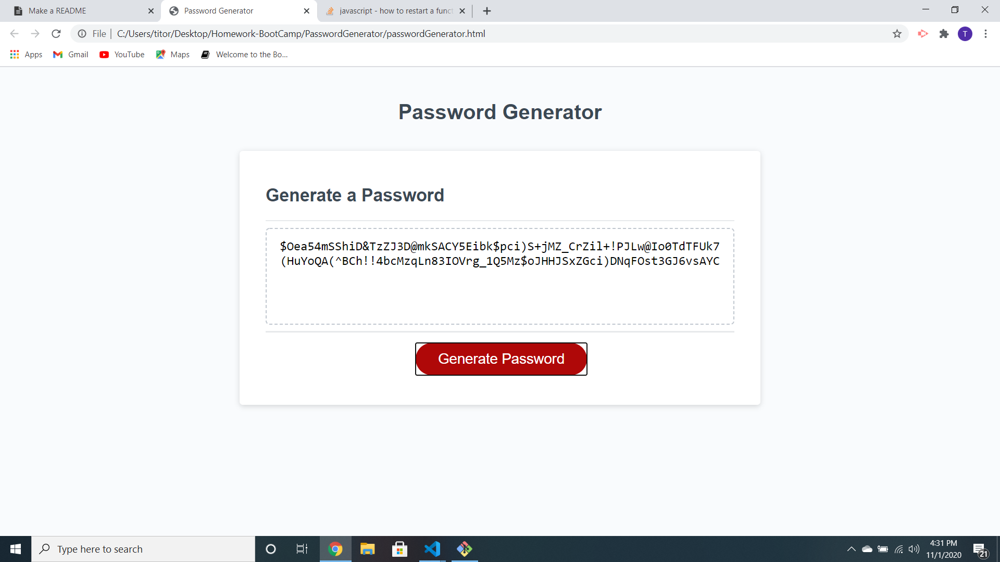

### RandomPasswordGenerator

### Motivation

* The motivation behind making this password generator was, and still is, keeping the security of everyone's personal profile's safe. Every year, millions of people have their accounts hacked whether it's social media or bank accounts. Data breaches are almost an inevitability in today's world, so having multiple, very complicated passwords across all platforms prevents hackers from accessing all your information at once. This password generator has the ability to make very long and complicated passwords that make it more difficult for hackers to penetrate your accounts. Seeing people's entire lives be ruined because of having the same easy passwords across all of their accounts is a big factor in creating this password generator.

### Features

* In it's current build, this application generates very complicated and long passwords to meet any criteria. When the "Generate Password" button is pressed, you are given 5 different options on password choice. It allows you to choose the number of characters for the password and also if the password should have uppercase, lowercase, special characters, or numbers, or a combination of everything. Once all that has been decided, the website will randomly generate a password that meets all the criteria in the box right above the button. The password generator can be used as many times as needed without any need to modify or reload the client. Simply click the generate button again.

### Build status

* This build is currently in it's final form. In the future there may be some updates to include settings such as saving passwords to clipboard. There may also be an update where passwords are saved from the password generator to whichever website is chosen. Saving information would require lots of security measures so it might be a while before that happens.

### Screenshots

*
*
*